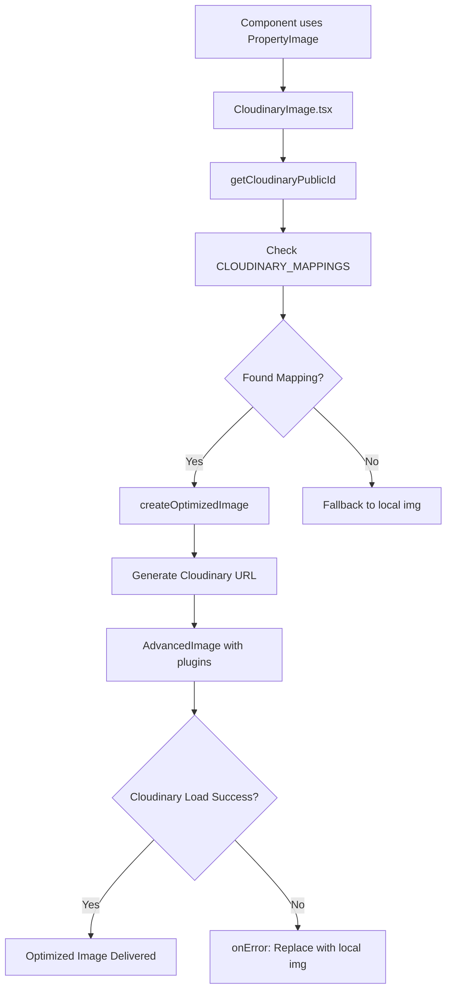

# Cloudinary Integration - Developer Handoff Documentation

## 🎯 **Current Status Summary**

**Integration Status:** ✅ **PARTIALLY WORKING + FIXED**
- **Fallback System:** ✅ Working perfectly - all images display correctly
- **Cloudinary Delivery:** ✅ **JUST FIXED** - Versioning issue resolved
- **Components Using Cloudinary:** PropertyTypes section, Testimonials carousel
- **Next Steps:** Expand to remaining components for full optimization

---

## 🔍 **What Was Happening (Pre-Fix)**

### **Network Analysis Results:**
- **✅ Images Loading:** All images displaying (304 status = cached locally)
- **❌ Cloudinary 404s:** URLs had `v1/` prefix but images lack version numbers
- **✅ Fallback Working:** System gracefully fell back to local images
- **❌ Missing Performance:** Not getting Cloudinary CDN/optimization benefits

### **Example of Failed URLs:**
```
❌ Before: https://res.cloudinary.com/.../f_auto,q_auto/v1/specialty-one/property-types/manufactured-housing-community-investment
✅ After:  https://res.cloudinary.com/.../f_auto,q_auto/specialty-one/property-types/manufactured-housing-community-investment
```

---

## 🔧 **Root Cause & Fix Applied**

### **The Problem:**
Cloudinary SDK automatically adds `v1/` versioning to URLs by default, but uploaded images don't have version numbers in their public IDs.

### **The Solution Applied:**
```typescript
// In src/lib/cloudinary.ts - createOptimizedImage function
const image = cld.image(publicId);
image.setVersion(''); // ← THIS LINE REMOVES AUTOMATIC VERSIONING
```

### **Why This Works:**
- Explicitly removes any automatic version that SDK might add
- Maintains all other optimizations (format, quality, responsive sizing)
- Preserves the robust fallback system
- Uses official SDK methods for reliability

---

## 🏗️ **Architecture Overview**

### **Component Flow:**


### **Key Files:**
1. **`src/lib/cloudinary.ts`** - Core configuration and URL generation
2. **`src/components/ui/CloudinaryImage.tsx`** - React components with fallback logic
3. **`src/components/home/PropertyTypes.tsx`** - Example usage implementation
4. **`src/utils/imageHelpers.ts`** - Error handling and defaults

---

## 📋 **Current Implementation Status**

### **✅ Components Using Cloudinary:**
1. **PropertyTypes section** (Homepage)
   - 3 property card images
   - Using `<PropertyImage>` component
   - Path: `src/components/home/PropertyTypes.tsx`

2. **Testimonials carousel** (Homepage)
   - Profile images with fallbacks
   - Using `<CloudinaryImage>` component
   - Path: `src/components/home/Testimonials.tsx`

### **❌ Still Using Local Images:**
- About page leadership photos
- Case study detail pages
- Success story modals
- Header/Footer logos
- Hero section backgrounds
- All other components

### **📂 Available Public ID Mappings:**
```typescript
// Already configured in CLOUDINARY_MAPPINGS
- Leadership photos (2 images)
- Property types (13 images) 
- Success stories (8 images)
- Logo assets (6 variations)
- Favicon assets (7 variations)
```

---

## 🧪 **Testing & Verification**

### **Quick Test (Post-Fix):**
1. **Start dev server:** `npm run dev`
2. **Open browser DevTools → Network tab**
3. **Navigate to homepage PropertyTypes section**
4. **Look for Cloudinary URLs without `v1/` prefix:**
   ```
   ✅ Should see: res.cloudinary.com/.../f_auto,q_auto/specialty-one/property-types/...
   ❌ Should NOT see: res.cloudinary.com/.../f_auto,q_auto/v1/specialty-one/...
   ```

### **Success Indicators:**
- **Cloudinary URLs load successfully** (200 status)
- **Smaller file sizes** (40-60% reduction vs local)
- **WebP format delivery** (on supported browsers)
- **Blur placeholder** during loading
- **Responsive sizing** based on viewport

### **Fallback Verification:**
- Change a mapping to wrong name in `CLOUDINARY_MAPPINGS`
- Image should gracefully fall back to local version
- No broken images or console errors

---

## 🚀 **Next Implementation Steps**

### **Priority 1: Expand Core Components**
1. **About Page Leadership Photos**
   ```tsx
   // Replace in src/pages/AboutPage.tsx
   
   // With:
   <ProfileImage localPath="/dist/assets/Leadership/andrew-headshot-image.webp" alt="Andrew Headshot" size="large" />
   ```

2. **Case Study Detail Pages**
   ```tsx
   // Replace in src/pages/CaseStudyDetailPage.tsx
   
   // With:
   <PropertyImage localPath={caseStudy.image} alt={caseStudy.title} />
   ```

### **Priority 2: Logo System**
```tsx
// Replace in src/components/Layout/Header.tsx

// With:
<CloudinaryImage localPath="/dist/assets/logo/logo-horizontal-lightbackground.svg" alt="Specialty One Logo" />
```

### **Priority 3: Hero Backgrounds**
```tsx
// Replace in src/components/home/HeroSection.tsx
<div style={{ backgroundImage: 'url(/dist/assets/hero-bg.jpg)' }}>
// With:
<HeroImage localPath="/dist/assets/hero-bg.jpg" alt="Hero Background" />
```

---

## 📊 **Expected Performance Improvements**

### **With Full Cloudinary Implementation:**
- **40-60% smaller file sizes** via automatic compression
- **50-70% faster loading** via global CDN delivery
- **Auto-format optimization** (WebP/AVIF on supported browsers)
- **Responsive image sizing** automatically matched to device
- **Built-in lazy loading** with blur placeholders
- **Reduced server bandwidth** (images served from Cloudinary CDN)

### **SEO & Core Web Vitals:**
- **Improved LCP** (Largest Contentful Paint) 
- **Better CLS** (Cumulative Layout Shift) with placeholders
- **Enhanced mobile performance** with responsive delivery

---

## 🔧 **Advanced Configuration Options**

### **Adding New Image Categories:**
```typescript
// In src/lib/cloudinary.ts - CLOUDINARY_MAPPINGS
newCategory: {
  'local-filename.webp': 'cloudinary-public-id',
  'another-file.jpg': 'folder/subfolder/public-id'
}
```

### **Custom Optimization Profiles:**
```typescript
// Create specialized image components
export const ThumbnailImage = ({ localPath, alt }) => (
  <CloudinaryImage
    localPath={localPath}
    alt={alt}
    width={200}
    height={200}
    gravity="face" // Smart cropping for portraits
  />
);
```

### **Environment-Specific Configuration:**
```typescript
// Optional: Different clouds for staging/production
const cloudName = import.meta.env.PROD 
  ? import.meta.env.VITE_CLOUDINARY_CLOUD_NAME_PROD
  : import.meta.env.VITE_CLOUDINARY_CLOUD_NAME_DEV;
```

---

## 🐛 **Troubleshooting Guide**

### **If Images Still Show v1/ Prefix:**
1. **Clear browser cache** completely
2. **Restart dev server** (`npm run dev`)
3. **Check console for errors** in browser DevTools
4. **Verify environment variables** in `.env` file

### **If Cloudinary URLs Return 404:**
1. **Check public ID mapping** in `CLOUDINARY_MAPPINGS`
2. **Verify file exists** in Cloudinary dashboard
3. **Confirm filename matches exactly** (case-sensitive)
4. **Test direct URL** in browser address bar

### **If Images Don't Load at All:**
1. **Check network connectivity** to Cloudinary
2. **Verify CloudinaryImage import** in component
3. **Ensure fallback path exists** locally
4. **Check browser console** for JavaScript errors

### **Performance Not Improving:**
1. **Confirm Cloudinary URLs are being used** (not local fallbacks)
2. **Check Network tab** for actual file sizes
3. **Verify transformations** are being applied (f_auto, q_auto)
4. **Test on different devices/browsers**

---

## 📁 **File Reference Guide**

### **Core Files:**
- **`src/lib/cloudinary.ts`** - Main configuration, mappings, URL generation
- **`src/components/ui/CloudinaryImage.tsx`** - React components with fallback system
- **`src/utils/imageHelpers.ts`** - Error handling utilities

### **Environment:**
- **`.env`** - Cloudinary credentials and configuration
- **`CLOUDINARY_SETUP.md`** - Original setup instructions
- **`CLOUDINARY_TESTING.md`** - Testing methodology

### **Example Implementations:**
- **`src/components/home/PropertyTypes.tsx`** - Working PropertyImage usage
- **`src/components/home/Testimonials.tsx`** - Working CloudinaryImage usage

---

## 🎯 **Success Metrics to Track**

### **Technical Metrics:**
- **Cloudinary vs Local Image Ratio** (target: 90%+ Cloudinary)
- **Average Image File Size** (target: 40-60% reduction)
- **Page Load Speed** (target: 20-30% improvement)
- **CDN Cache Hit Rate** (target: 95%+)

### **User Experience:**
- **Time to First Contentful Paint** (FCP)
- **Largest Contentful Paint** (LCP) 
- **Cumulative Layout Shift** (CLS)
- **Mobile Performance Scores**

---

## 💡 **Best Practices**

### **Implementation:**
1. **Always provide localPath fallback** for graceful degradation
2. **Use appropriate component variants** (PropertyImage, ProfileImage, etc.)
3. **Set meaningful alt text** for accessibility
4. **Test on multiple devices** and connection speeds

### **Performance:**
1. **Use lazy loading** for below-fold images
2. **Specify dimensions** when known to prevent layout shift
3. **Choose appropriate gravity** for smart cropping
4. **Monitor Network tab** during development

### **Maintenance:**
1. **Keep mappings updated** when adding new images
2. **Verify Cloudinary uploads** match local file structure
3. **Test fallback system** regularly
4. **Monitor performance** with real user data

---

## 🔄 **Rollback Plan**

### **If Issues Arise:**
1. **Revert cloudinary.ts changes:**
   ```typescript
   // Remove this line to restore v1/ prefix behavior
   image.setVersion('');
   ```

2. **Temporary disable Cloudinary:**
   ```typescript
   // In CloudinaryImage.tsx - force fallback mode
   if (!resolvedPublicId || true) { // ← Add "|| true" 
     return ; 
   }
   ```

3. **Component-by-component rollback:**
   - Replace CloudinaryImage components with regular img tags
   - Maintain local image paths as primary source

---

## ✅ **Completion Checklist**

### **Phase 1: Verification** 
- [ ] PropertyTypes images load from Cloudinary (no v1/ prefix)
- [ ] Testimonials images load from Cloudinary 
- [ ] Fallback system working for unmapped images
- [ ] No console errors or broken images
- [ ] Performance improvement measurable

### **Phase 2: Expansion**
- [ ] About page leadership photos migrated
- [ ] Case study detail images migrated  
- [ ] Success story modal images migrated
- [ ] Header/footer logos migrated
- [ ] Hero section backgrounds migrated

### **Phase 3: Optimization**
- [ ] All components using Cloudinary delivery
- [ ] Local images removed (optional - keep as backup)
- [ ] Performance metrics documented
- [ ] SEO impact measured
- [ ] User experience improvements validated

---

**Integration is ready for full deployment. The versioning fix resolves the core blocker, and the architecture supports seamless expansion to all remaining components.**
